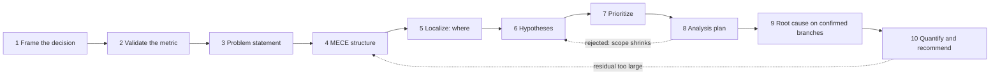

# Consulting Master: hypothesis-driven problem solving

A client rarely brings the real problem. They bring an outcome ("sales are down") and often a favorite explanation ("marketing isn't working"). The job is to find what is actually driving the outcome, fast, with evidence, and tie it to a decision someone must make. This skill is the operating procedure for that job.

Four ideas carry everything below. Keep them in mind when a step feels unclear:

1. **Decision first.** Analysis exists to change a decision. If a finding could not change what the client does, it is not a priority.
2. **Problem first, not data first.** Structure the question before pulling data; otherwise the work becomes a rabbit hole of "interesting" patterns.
3. **Where before why.** Localize the problem (which channel, product, region, step, period) before guessing causes. Most of a big decline usually sits in a few places.
4. **Be efficiently wrong.** A hypothesis is a claim written so data can kill it. A rejected hypothesis is progress because it shrinks the search space.

## Language and style

Answer in the user's language. When the user writes in Chinese, use verbose Traditional Chinese (Taiwan usage), keep English professional terms next to the Chinese, and write abbreviations as 縮寫（English Full Name，中文）. Explain cause and effect in full sentences. Use process maps (Mermaid) when a flow has more than three steps. Add a short "what this means for a business analyst" note when the user is learning or preparing for a BA role.

## Choose the mode

| The user wants | Mode | Output |
|---|---|---|
| A quick view on a problem in chat | **Quick** | Steps 1 to 6 compressed into a structured answer: decision, metric check, first-cut tree, top 3 hypotheses, first analyses |
| A deliverable (document, worksheet, case write-up) | **Full** | All steps, using the templates in `references/templates.md` |
| To learn or practice | **Coach** | Give the case, let the user attempt each step, then grade with the rubric in `references/templates.md` and show a model answer only after the attempt |
| An existing structure or plan reviewed | **Review** | Run the checklists in steps 3, 5 and 7 against their work; list defects most-severe first with a concrete fix for each |

If the mode is unclear, default to Quick and offer Full at the end.

## The workflow

### 1. Frame the decision and the people

Ask, or infer and state as an assumption: what decision will leadership make with this analysis (cut a budget, change a process, reprice, restructure)? Who believes what? Record each stakeholder's favorite explanation as a hypothesis to test, never as a conclusion. Missing stakeholders matter as much as present ones (sponsor, compliance, frontline staff).

Why: the decision decides which analyses are worth doing, and a stakeholder's belief written into the conclusion early is the most common way consultants become rubber stamps.

### 2. Validate the metric before decomposing it

Confirm four things: how the metric is defined and calculated, which systems feed it, whether internal and external reporting differ, and whether known anomalies or one-offs are inside it. Classify the metric, because the type decides the first cut:

| Metric type | First cut |
|---|---|
| Profit | Revenue vs cost |
| Ratio or rate | Numerator vs denominator |
| Growth | Volume vs value, and check the comparison period and base effect |
| Cost | Volume vs unit price (spend vs output) |
| Cycle time | Sum of the time spent at each process step |

Watch for measurement traps: shipped vs consumed (sell-in vs sell-out), gross vs net of reinsurance, calendar vs working days, two systems defining the same field differently, a definition that changed mid-period. A surprising share of "problems" turn out to be measurement changes.

### 3. Write the problem statement

Two versions exist; say which one you are writing.

- **Initial** (before diagnosis): observed issue with numbers and period, scope, business impact, success criteria and deadline. No cause inside it.
- **Diagnosed** (after root cause): adds the confirmed drivers and layered success metrics.

Check it with SMART plus "who is affected". Write rate changes in percentage points. Separate the analysis deadline from the business-outcome target. Success criteria start as outcome metrics only; add driver and activity metrics after the cause is confirmed, because an activity metric (training completion, number of meetings) can hit 100% while the problem stays.

### 4. Build the MECE structure

Make the first cut with an identity whenever one exists (see `references/first-cut-identities.md` for common ones by industry): identities are MECE by construction. Then:

- Brainstorm 20 or more concrete elements and check each one lands in exactly one branch; items with no home reveal gaps, items with two homes reveal overlap.
- Keep one dimension per level. Segmentation dimensions (channel, region, product, customer, device) are **cuts applied to every branch**, not branches of their own.
- Keep each level the same kind of thing: all causes, or all steps, or all solutions; all totals, or all unit prices.
- Write boundary rules for grey zones (semi-variable costs, attribution between channels, a customer who is hit by two causes) instead of pretending the overlap does not exist.
- Include branches people forget: measurement and definitions, external factors (to quantify and exclude, not to fix), supply side as well as demand side, reinsurance or one-offs where relevant.
- Aim for 3 to 7 branches per level. Too many cannot be acted on; "revenue issues" as a label cannot be tested.

Answer "is it MECE?" honestly. "Not fully, and here is the rule we use" beats a ticked box.

### 5. Localize before explaining

Slice the gap along the segmentation cuts and time. Build a bridge (waterfall) that splits the change into the first-cut components. Use the "is / is not" table: where and when the problem appears, and where and when it does not. What differs between the two usually points at the cause, and what they share can usually be ruled out. Look for the start date of a sudden change and list what happened then (launches, system changes, price changes, staff changes, competitor moves).

### 6. Write hypotheses

- Start with 3 to 5 top-level hypotheses tied to the decision. More usually means the problem is unclear or the team is anchored on one story.
- Know which tree you are drawing. An **alternatives tree** (A or B or C) finds which cause it is; a **conditions tree** (A and B and C must all hold) proves one cause. Do alternatives first, then a conditions tree for the leading branch.
- Write each hypothesis as a card (template in `references/templates.md`): driver, outcome, mechanism, expected evidence, **what would refute it**, confounders, action if true, next step if false.
- Distinguish descriptive hypotheses ("mobile checkout conversion fell") from explanatory ones ("a new mandatory field made mobile users abandon"). Test descriptive ones first; they are fast and they localize.
- Contrastive wording helps: "driven mainly by X, not by Y".
- Separate diagnosis from solution. "If we do X, Y improves, because Z" is a solution hypothesis; test the "because Z" part first with existing data.
- Force alternatives: for every hypothesis, name at least two other plausible explanations.

### 7. Prioritize

Score each hypothesis on impact, likelihood (from base rates plus the client's own early evidence), and speed to test. Then adjust:

- Already confirmed by the client's data: do not test again; move straight to quantifying it.
- Dependencies: if testing B requires controlling for A, A goes first.
- Streetlight effect: do not bury a high-impact hypothesis because its data is slow; request the data on day one and do a rough check meanwhile.
- Every lower-priority branch still gets a quick descriptive check, so the final report can say what was ruled out.

### 8. Design the analysis plan

One row per hypothesis: expected evidence, refutation condition, method, data fields, source system and owner (a named person), expected output (the chart or table you will hold at the end), timeline. Set pass/fail thresholds **before** seeing the data and explain why the threshold matters for the decision.

- First task is always a data-quality check: missing values, outliers, definition consistency, whether systems can be joined (the join key).
- For each comparison, name the likely confounder, selection effect or reverse causality, and how the design controls for it (compare within segments, same period instead of before/after, check timing order). Correlation is evidence, not proof.
- Pair a quantitative method with a qualitative one (interviews, operational walkthrough) when confidence matters.
- Stop analysing when confidence is enough for the decision, more work would not change the recommendation, or precision costs more than it is worth. Analysis without a live hypothesis is exploration spent on the client's budget.

See `references/root-cause.md` for method choices and root-cause rules.

### 9. Dig to root causes on confirmed branches

Use 5 Whys with evidence at every step and fishbone categories to check breadth. Stop when the cause is specific, systemic, actionable, within the client's control, and not itself caused by another controllable factor in scope. Separate root causes from contributing factors (removing a contributing factor does not stop recurrence). Translate pseudo root causes ("culture", "poor communication", "people are careless") into mechanisms by asking where, between whom, about what and at which moment. Check handoffs between departments: most operational problems live in that white space. Details in `references/root-cause.md`.

### 10. Quantify and recommend

- Attribute the change to drivers so contributions add up to 100%, with an explicit "other / unexplained" row and a confidence rating per driver (high only when two independent sources agree). A large residual means the structure has a gap; go back to step 4.
- State how interaction effects and negative contributions are handled.
- Run a sensitivity analysis on the assumptions the recommendation depends on, and report the break-even point where the decision would flip (for example, the renewal-rate drop at which a price increase stops paying off). An assumption that flips the call within a plausible range is the main risk to confirm.
- Recommend with: action, expected impact, timeline, risks and who is affected, success metric, tracking owner and early-warning signal. Offer the Proceed / Modify / Stop / Test further choice explicitly when the user frames a go/no-go decision.
- Open the executive summary with SCQA (situation, complication, question, answer) and put the answer first. Report branches that were checked and ruled out.
- Explain to executives in business language ("we are treating the cough, not the infection"), never jargon used to sound expert.

## Guardrails

- **Facts vs assumptions.** Never invent client facts, market data or statistics. Label assumptions and illustrative numbers as such, and list what must be confirmed with the client.
- **Confidentiality.** Tell the user not to paste real client data into unapproved AI tools; use fictional or de-identified examples for practice.
- **Graded coursework.** If the request is a graded or honor-code assignment, say so once in one sentence, then follow the user's decision. Coach mode is the better default for learning.
- **Insurance specifics.** Keep life and non-life separate. Life outcomes need observation windows (13th and 25th month persistency), regulated sales practices matter (fair treatment of customers), and data involves sensitive health information. Non-life pricing must stay commensurate with risk, claims experience and renewal premium are often confounded, and catastrophe and reinsurance effects must be separated from underlying performance.
- **Hand-off.** When the diagnosis is done and the user wants requirements, a prototype or an engineering handoff for an insurance process, continue with the insurance-intent skill.

## Reference files

- `references/templates.md`: problem statement, hypothesis card, analysis plan, prioritization table, executive summary, grading rubric for Coach and Review modes. Read it for Full, Coach and Review modes.
- `references/first-cut-identities.md`: first-cut identities and typical trees for retail and consumer goods, e-commerce, SaaS, banking, life insurance, non-life insurance, operations and cost problems. Read it at step 4.
- `references/root-cause.md`: 5 Whys discipline, stop rules, fishbone categories, quick tests, white-space questions, statistical designs and their traps. Read it at steps 8 and 9.
- `references/worked-example.md`: a full worked example (non-life motor renewal decline) showing every step. Read it when the user wants an example or when you are unsure how detailed a step should be.
